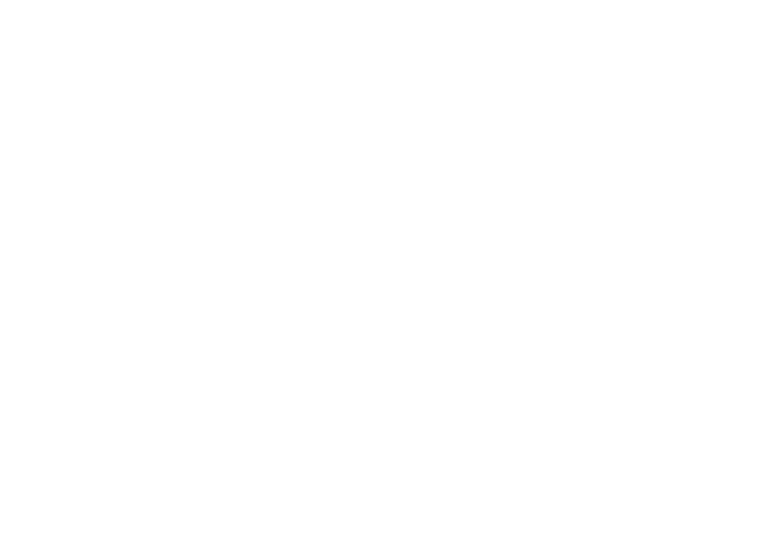

<!--suppress HtmlUnknownAnchorTarget -->

  

# Objectives

Developpe a website where JustStreamIt followers can view the classed movies.

Fetch movies's data from the [OCMovies](https://github.com/OpenClassrooms-Student-Center/OCMovies-API-EN-FR) REST API to create a Netflix-like clone.
Using vanilla Javascript.
W3C validated for `HTML` and `CSS`

# Setup

Clone or download the [API OCMovies](https://github.com/OpenClassrooms-Student-Center/OCMovies-API-EN-FR).
Refer to the [documentation](https://github.com/OpenClassrooms-Student-Center/OCMovies-API-EN-FR#option-2-installation-and-execution-without-pipenv-using-venv-and-pip) 
(steps 3 to 7) to install and start the server locally.

Clone the project: `git clone git@github.com:Maiphuongthao/MAIPhuongThao_6_042023.git`.

To modify CSS: 

Run `npm run sass` => compile sass for dev ( not minified). Watch for any change inside scss files.

Run `npm run start` => compile sass for prod ( minified). Don't watch for any change inside scss file.

# Usage

To access the page, open the `index.html` file in any web browser.
Or [github page](https://maiphuongthao.github.io/MAIPhuongThao_6_042023/)

